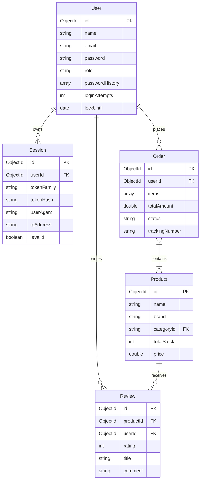
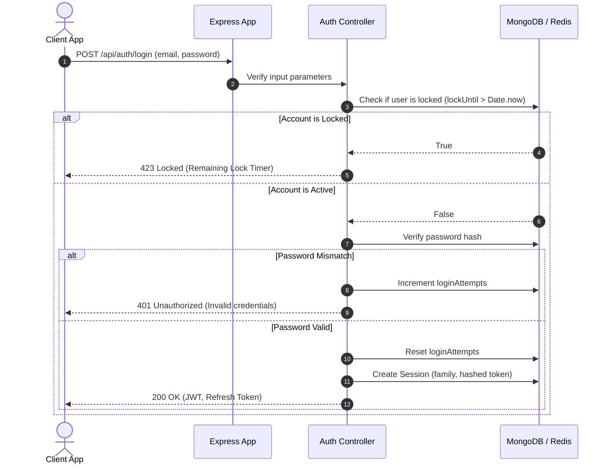
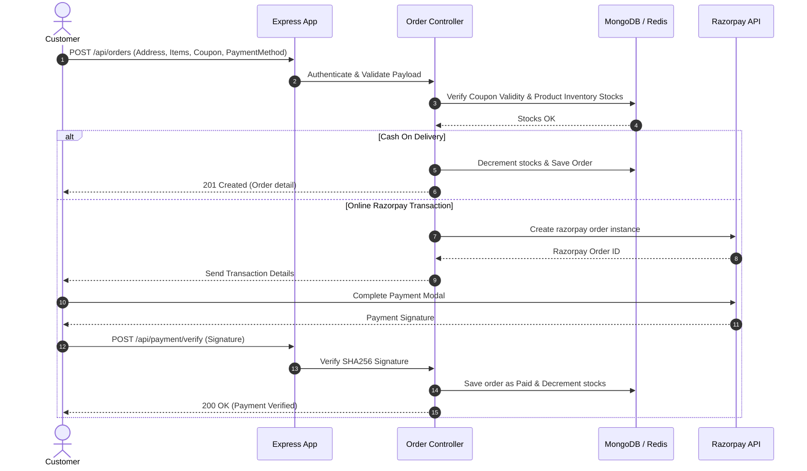

# TECHNICAL SYSTEMS GUIDE — LYVO Architecture

This document exposes the system specifications, data models, interaction sequence flows, and REST API definitions for LYVO.

---

## 🏗️ 1. Database Model Relations (ER Schema)

---

## 🔒 2. Authentication Sequence Flow (RTR & Lockout Validation)

---

## 🛒 3. Checkout & Transaction processing Flow

---

## 🔌 4. REST API Specification (OpenAPI/Swagger Summary)

### Authentication Resource
- `POST /api/auth/register`: Create user account.
- `POST /api/auth/login`: Login user. Handles lockout and password checks.
- `POST /api/auth/refresh`: Dynamic Refresh Token Rotation (RTR). Revokes all sessions on token reuse anomaly.
- `POST /api/auth/logout`: Revoke current active session.
- `POST /api/auth/logout-all`: Revoke all user sessions.

### Product Resource
- `GET /api/products`: Filter and paginate catalog items.
- `GET /api/products/:id`: Fetch detailed specifications.
- `POST /api/products` (Admin): Create catalog product.

### Order Resource
- `POST /api/orders`: Place customer order.
- `GET /api/orders/my`: Fetch customer history lists.
- `GET /api/orders/track/:orderNumber`: Live tracking details.
